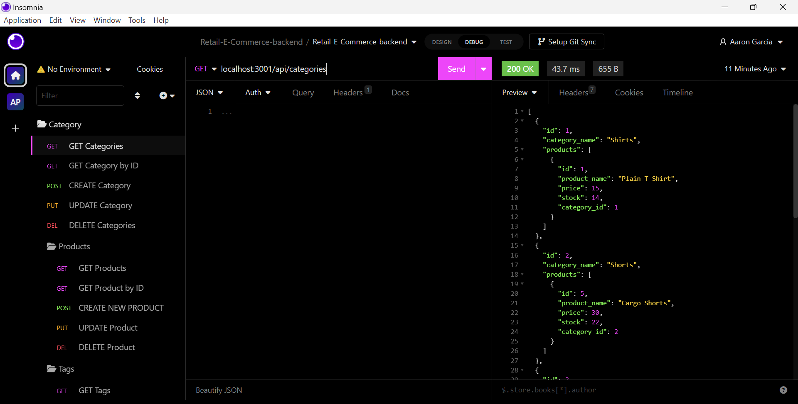
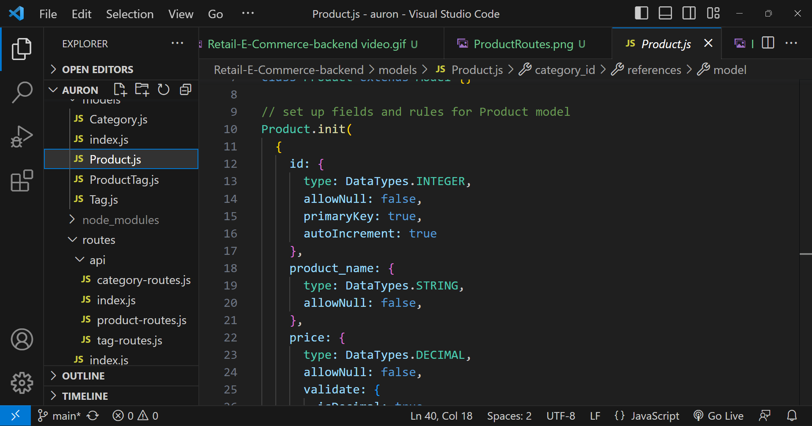
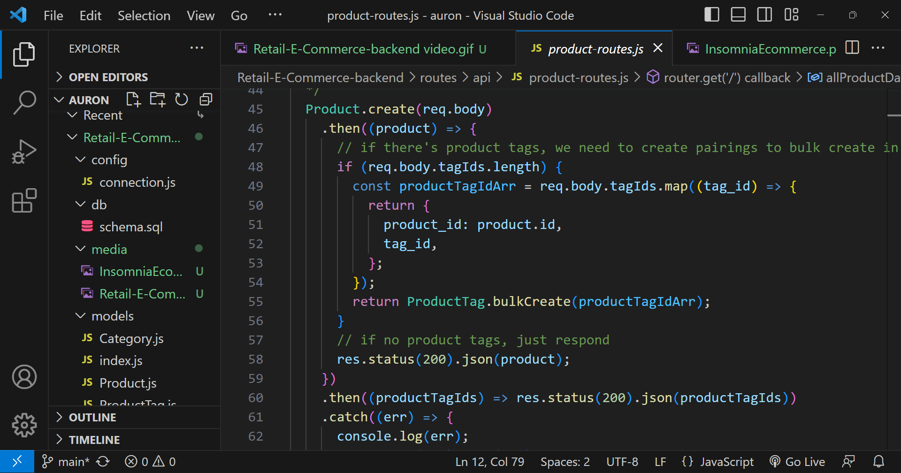

  

# Retail-E-Commerce-backend

## Description
App to keep track of stock in an e-commerce environment.

## Table of Contents
- [Installation](#Installation)
- [Usage](#Usage)
- [Credits](#Credits)
- [License](#License)
- [Contributors](#Contributing)
- [Tests](#Tests)
- [Questions](#Questions)

## Installation
Please install node.js 
  
## Usage 
This app will allow the user track store stock items. Allows creation, update and deletion abilities for stock items.

## Credits 
Got some code from Eli, the instructor for our class, for the models. Used the driver's license and libary card exercises to help set up routes and complete models. Did also compare to Josh's (https://github.com/stanjosh) from class and user njthanhtrang (https://github.com/njthanhtrang) to fix minor issues in tag-routes.js.

## License 
For more info, please visit: [License Link](https://opensource.org/licenses/MIT)

## Contributing
Feel free to add wonderful features

## Tests 
N/A

## Questions 
If you have any questions you can find me at [SilvAG6271](https://github.com/SilvAG6271) and <a href="mailto:auron7985@gmail.com">auron7985@gmail.com</a>.
